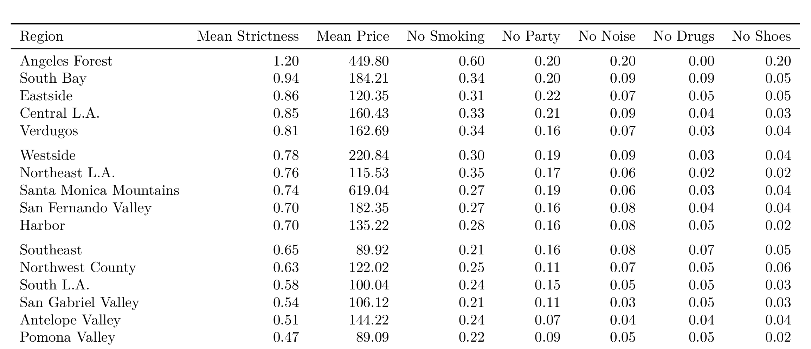

## Airbnb in Los Angeles: Analyzing Strictness Levels in House ListingsAround the City

### by Liam Carrigan, Lily Damron, Brian Lin, Ignat Kulinka, Aida Ylanan

#### University of California, Los Angeles
  
  
    
## Abstract

Airbnb listings provide new and unique ways to explore a city. The site, which allows homeowners in the city to open up and share their space with visitors, shares listing information such as the listing’s location, price per night, and house rules. Using listing location and house rules, our team conducted a regional analysis of Los Angeles by comparing the average “strictness” level of regions in the city based on data from its Airbnb listings. We created two new variables, region and strictness, to conduct this analysis. We found that listings in West Los Angeles are stricter, on average, than listings in East Los Angeles. We also found No Smoking and No Partying to be the most common house rules in the city.

## Methodology

##### Data Cleaning 
Before we could perform exploratory analysis, some basic data cleaning had to be performed. Unwanted symbols in the price variable, such as dollar signs and commas, had to be removed in order to calculate summary statistics.
  
  
##### Feature Creation
Performing a structural analysis of the dataset revealed that Airbnb had partitioned its listings into 254 unique neighborhoods, with listing density ranging from a single listing in one neighborhood to 2046 listings in another. The disparity in listing count per regions clearly rendered our current plan for neighborhood comparison invalid, and our group sought strategies to make listing distribution more equitable between areas. We decided to group each neighborhood into larger areas using region partitions defined by a [Los Angeles Times neighborhood analysis](http://maps.latimes.com/neighborhoods/neighborhood/list/). The article provided a table that matched each neighborhood to a particular region; we scraped this table using R and joined this table with our existing listings dataset by neighbourhood. Plots showing the outlines of the previous neighborhood listings and the new regional listings can be found below:

The new region variable we created reduced area count from 254 neighborhoods to 16 larger regions. Though listings from areas north of Los Angeles City are much fewer in number than those in the city proper and to the south, the distribution of listings per region was much more equitable than the original distributions per neighborhood. The plot showing the distribution of listings per region can be found below:

We added another variable to the dataset that quantified more information about each listing. We called this the strictness variable, which counted the number of house rules listed in a particular listing. We generated regular expressions that would search the house_rules variable for certain phrases that indicated our house rules of interest. We extracted a number of house rules and created some linear models to determine which of these rules were significant. The rules are as follows: No Smoking, No Drugs, No Parties, No Drinking/Alcohol, No Loud Noise, and No Pets.

The strictness variable takes values from 0 to 6, each number a count of how many of the most popular rules are named in the listing. For example, a listing with No Smoking and No Drugs would get a strictness score of 2. Stricter listings have a strictness score closer to 6. 

## Results

The following comparative analyses exclude the Angeles Forest region, which only had one observation.
Comparative analysis of the different regions in Los Angeles reveals that South Bay is the strictest region in the area. The area with the most expensive listings, on average, is the Santa Monica Mountain region. The least expensive region, on average, is the Southeast region. A table of our results is displayed below:

Using this information, we created three plots that display strictness levels per listing and per region. The regional plot displays the average strictness level per region. The plot displaying individual listings also reveals the disparity in listing density per region, an important caveat to keep in mind when interpreting the results. The two plots can be viewed below:

We also looked within the house_rules and strictness variables to see which rules and which pairs of rules are most common. The most common rule is No Smoking, while the most common pair of rules is No Smoking and No Partying. The results are displayed on the stacked bar chart below: 

